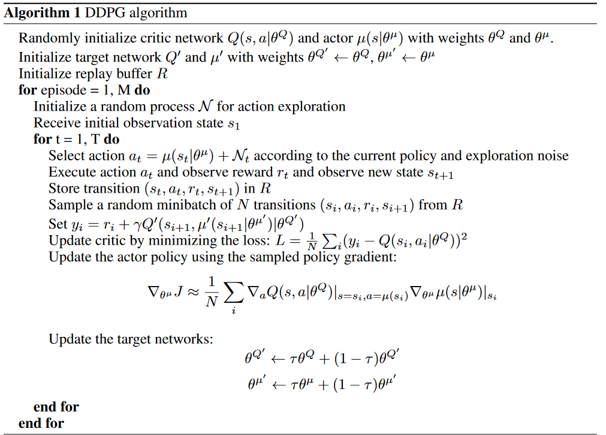

# Pytorch implementation of DDPG
This is a pytorch implementation of [Deep Deterministic Policy Gradients](https://arxiv.org/abs/1509.02971), using  [Ornstein–Uhlenbeck process](https://en.wikipedia.org/wiki/Ornstein%E2%80%93Uhlenbeck_process) for exploring in continuous action space while using a Deterministic policy.

Environment is provided by the [openAI gym](https://gym.openai.com/envs/)

Base environment and agent is written in [RL-Glue standard](http://www.jmlr.org/papers/v10/tanner09a.html), providing the library and abstract classes to inherit from for reinforcement learning experiments.

## Results
<table align='center'>
<tr align='center'>
<td> Environment </td>
<td> reward sum for each episode </td>
<td> result </td>
</tr>
<tr>
<td> LunarLanderContinuous-v2 </td>
<td> 
<td>
</tr>
<tr>
<td> MountainCarContinuous-v0 </td>
<td> 
<td>
</tr>
<tr>
<td> Pendulum-v0 </td>
<td> 
<td>
</tr>
</table>

## DDPG Algorithm



## Policy Estimation (Actor)
Actor Network consists of a 3-layer neural network taking into input the state (s) and outputs the action (a) which should be taken denoted by Pi(s). The 2 hidden layers are 400 and 300 units respectively as per [paper](https://arxiv.org/abs/1509.02971) by Lilicrap et al. 

Input layer and intermediate layers uses ReLU activation function, with output layers using tanh activation function.

## Policy Evaluation (Critic)
Critic Network consists of a 3-layer neural network taking into input the state (s) and corresponding action (a) and outputs the state-action value denoted by Q(s, a). The 2 hidden layers are 400 and 300 units respectively as per [paper](https://arxiv.org/abs/1509.02971) by Lilicrap et al.

Input layer and intermediate layers uses ReLU activation function.

## Actor Optimization
Actor network is optimized by minimizing -Q(s, Pi(s)).mean()

## Critic Optimization
Critic network is optimized by minimizing mse_loss(r+ γ*Q(s', Pi(s')) - Q(s, a))

## Initialization Details

* Replay buffer size of 1,000,000.

### Critic Network
* Weight decay = 10−2
* Discount factor γ = 0.99
* Soft target updates τ = 0.001
* Final layer weights and biases initialized from uniform distribution of [−3×10−3,3×10−3]
* ALl other layers weights initialized from uniform distributions[−1/√f,1/√f], where f is the fan-in of the layer

### Actor Network
* Final layer weights and biases initialized from uniform distribution of [−3×10−3,3×10−3]
* ALl other layers weights initialized from uniform distributions[−1/√f,1/√f], where f is the fan-in of the layer


## Dependencies
* [Instructions for installing openAI gym environment in Windows](https://towardsdatascience.com/how-to-install-openai-gym-in-a-windows-environment-338969e24d30)
* Tqdm
* ffmpeg (conda install -c conda-forge ffmpeg)
* pytorch (conda install pytorch torchvision cudatoolkit=10.2 -c pytorch)
* numpy
* argparse
* moviepy

## How to use

### Training model for openai gym environment
```
git clone https://github.com/Jason-CKY/pytorch_DDPG.git
cd lunar_lander_DQN
Edit experiment parameters in main.py
 * change environment_parameters['gym_environment'] to desired environment to train in
python main.py
```

### Testing trained model performance
```
python test.py
usage: test.py [-h] [--env ENV] [--checkpoint CHECKPOINT] [--gif]

optional arguments:
  -h, --help            show this help message and exit
  --env ENV             Environment name
  --checkpoint CHECKPOINT
                        Name of checkpoint.pth file under model_weights/env/
  --gif                 Save rendered episode as a gif to model_weights/env/episode.gif
```